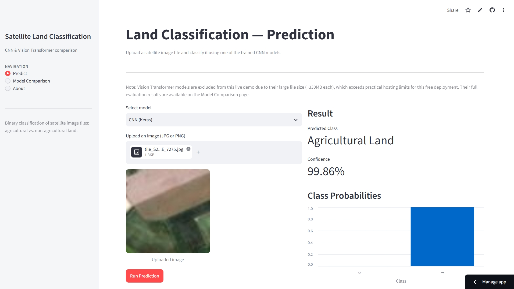
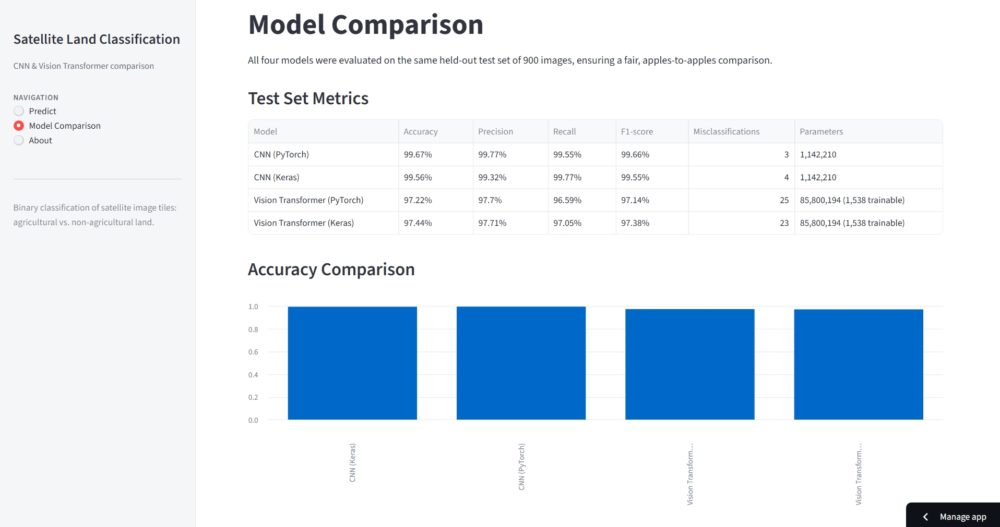

# Satellite Land Classification

**A deep learning system that looks at a satellite photo of a small patch of land and tells you: is this agricultural land, or not?**

Live demo: [satellite-land-classification-project.streamlit.app](https://satellite-land-classification-project.streamlit.app)

---

## What is this project, in plain terms?

Imagine you're an AI engineer at a fertilizer company. Your job is to help the company figure out, automatically and at scale, which patches of land (seen from a satellite) are farmland and which aren't — without a human having to look at every single image by hand.

This project builds and compares **four different deep learning models** that solve exactly that problem, and packages the whole thing into an interactive web app anyone can try.

It was built independently, from scratch, as a structured learning project inspired by the topic structure of IBM's "AI Capstone Project with Deep Learning" course — every line of code, every experiment, and every result in this repository was written and run personally, not copied from the course.

## Try it yourself

Open the live app, upload a satellite image tile (or use one from `data/raw/images_dataSAT/` after cloning), pick a model, and get an instant prediction with a confidence score:

**[satellite-land-classification-project.streamlit.app](https://satellite-land-classification-project.streamlit.app)**

| Prediction Page | Model Comparison Page |
|---|---|
|  |  |

## The Question This Project Answers

**Given a small satellite image, can a computer reliably tell agricultural land apart from everything else — and does throwing a bigger, fancier AI model at the problem actually make it better?**

Spoiler: not always. Keep reading.

## The Dataset

- 6,000 satellite image tiles, 64x64 pixels each
- Perfectly balanced: 3,000 images of agricultural land, 3,000 of non-agricultural land
- Split into training (4,200), validation (900), and test (900) sets — the test set is never seen during training, so its results reflect real-world performance

## What Was Built

The project is organized into three stages, each building on the last:

### 1. Data Handling
Before training anything, two different ways of feeding images into a model were implemented and compared:
- **Loading everything into memory at once** (simple, fast once loaded, but doesn't scale to huge datasets)
- **Loading images on-the-fly in small batches** (slower per batch, but scales to datasets far larger than available RAM)

A data augmentation pipeline was also built — automatically flipping, rotating, and adjusting the brightness of training images so the model learns general patterns instead of memorizing exact pictures.

### 2. CNN Development
A **Convolutional Neural Network (CNN)** — the classic, battle-tested architecture for image recognition — was built and trained **twice**: once using PyTorch, once using Keras/TensorFlow, using the exact same architecture (1.14 million parameters) in both, purely to compare the two frameworks fairly.

### 3. Vision Transformer Integration
A much larger, modern architecture called a **Vision Transformer (ViT)** — pre-trained by Google on millions of everyday photos — was adapted to this task via transfer learning, again in both PyTorch and Keras, using the exact same pre-trained weights in both frameworks.

## Results

All four models were evaluated on the same 900 held-out test images, so the comparison below is genuinely apples-to-apples.

| Model | Accuracy | Precision | Recall | F1-score | Parameters |
|---|---|---|---|---|---|
| **CNN (PyTorch)** | **99.67%** | 99.77% | 99.55% | 99.66% | 1.14M |
| **CNN (Keras)** | **99.56%** | 99.32% | 99.77% | 99.55% | 1.14M |
| Vision Transformer (PyTorch) | 97.22% | 97.70% | 96.59% | 97.14% | 85.8M |
| Vision Transformer (Keras) | 97.44% | 97.71% | 97.05% | 97.38% | 85.8M |

### The Interesting Finding

The small, custom-built CNN (1.14 million parameters) **outperformed** the much larger, pre-trained Vision Transformer (85.8 million parameters — 75 times bigger).

Why? The ViT was pre-trained on everyday photos (cats, cars, furniture) at high resolution. Our satellite images are small (64x64), highly specialized, and visually nothing like what the ViT originally learned from. The CNN, on the other hand, was trained from scratch **specifically** on this exact kind of image. Specialization beat scale, in this case.

This is a genuinely useful, real-world lesson: **a bigger pre-trained AI model is not automatically the better choice** — it depends heavily on how similar your data is to what that model originally learned from.

Full breakdowns, training curves, and framework-by-framework analysis are documented in [`docs/module2_cnn_development.md`](docs/module2_cnn_development.md) and [`docs/module3_vit_integration.md`](docs/module3_vit_integration.md).

## The Interactive Dashboard

Beyond the model training, this project includes a full web application (built with Streamlit) with three pages:

- **Predict** — upload any satellite image tile and get a live prediction from either CNN model
- **Model Comparison** — a full metrics table and chart comparing all four models
- **About** — a project overview, for anyone who lands on the app without context

> Note: the Vision Transformer models are not available in the live demo (though their results are shown on the Comparison page) — their saved weight files are ~330MB each, too large to host on this free deployment. This is documented transparently in the app itself rather than hidden.

## Project Structure

```
satellite-land-classification/
├── app/                      # Streamlit dashboard (Predict, Comparison, About pages)
├── data/
│   ├── raw/                  # downloaded dataset (not committed — see below)
│   └── processed/            # train/val/test split definition (split.json)
├── docs/                     # detailed write-up for every stage of the project
│   └── screenshots/          # dashboard screenshots used in this README
├── notebooks/                # reserved for exploratory analysis — not used in this
│                              # project, since all development was done in version-
│                              # controlled .py scripts instead of notebooks
├── outputs/
│   ├── models/                # trained model weights (CNNs committed; ViTs excluded — too large)
│   └── figures/                # generated plots (e.g. augmentation preview)
├── src/
│   ├── data_handling/         # data loading, augmentation, dataset splitting
│   └── models/                 # model architectures, training, and evaluation scripts
├── requirements.txt
└── README.md
```

## Running It Yourself

### 1. Clone the repository

```bash
git clone https://github.com/abdallahsaeedfsafis/satellite-land-classification.git
cd satellite-land-classification
```

### 2. Install dependencies

This project uses two frameworks (PyTorch and TensorFlow) that can conflict if installed carelessly. A single environment with the pinned versions below is sufficient to run the dashboard and the CNN scripts:

```bash
pip install -r requirements.txt
```

### 3. Download the dataset (only needed to retrain models from scratch)

```bash
python src/data_handling/download_data.py
```

### 4. Run the dashboard locally

```bash
streamlit run app/main.py
```

## Documentation

Every stage of this project has a dedicated, detailed write-up:

- [`docs/module1_data_handling.md`](docs/module1_data_handling.md) — dataset stats, loading strategy comparison
- [`docs/module1_comparison.md`](docs/module1_comparison.md) — memory-based vs. generator-based loading, in depth
- [`docs/module2_cnn_development.md`](docs/module2_cnn_development.md) — CNN architecture, training, full PyTorch vs. Keras comparison
- [`docs/module3_vit_integration.md`](docs/module3_vit_integration.md) — Vision Transformer fine-tuning and CNN vs. ViT analysis

## What This Project Demonstrates

- Building complete deep learning pipelines end-to-end: data → model → training → evaluation → deployment
- Working confidently in both major deep learning frameworks (PyTorch and TensorFlow/Keras)
- Applying transfer learning with a pre-trained transformer model, and honestly evaluating when it does and doesn't help
- Rigorous, fair experimental comparison — every result in this project was evaluated on the same identical test set
- Shipping a real, working, deployed product (not just a notebook) that anyone can open and use
- Clean project structure, git history, and documentation practices used in professional software development

## Status

All planned stages are complete: data handling, CNN development, Vision Transformer integration, and deployment.